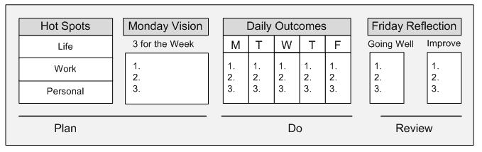

"Getting Results the Agile Way" by JD Meier can be seen as a roadmap for Gen Z to achieve personal and professional goals – similar to how you plan an exciting trip. Let's take a look at a concrete example of how you can apply the principles from "Getting Results the Agile Way". Imagine you're a college student, looking to improve your study performance and time management. Here's how you can apply the principles from the book:

<!-- truncate -->

  <small>source: <a href="https://tenor.com" target="_blank">gettingresults.com.com</a></small>

### Monday Vision:
Every week, on Monday, you create a plan for the week. For instance, you have a goal to study for 20 hours this week to prepare for an important exam. You specify the subjects you'll study and the number of hours you'll allocate to each.

### Daily Outcomes: 
Each day, you break down your weekly plan into daily goals. For example, on Tuesday, you decide to study Math for 2 hours and Literature for 1 hour. You take notes on what you've learned and the results you've achieved during the day.

### Friday Reflection: 
At the end of the week, you summarize what you've learned and achieved during the week. You reflect on whether you've met your goals and consider what you can do better in the future. You can adjust your plan for the following week based on what you've learned.

### Three Wins: 
Every day, you find three small accomplishments to celebrate. For instance, after completing 2 hours of Math, you might reward yourself with an ice cream and feel satisfied with your accomplishments.

### Rule of Three: 
By focusing on three daily goals, you ensure that you're never overwhelmed. You can concentrate strongly on studying the three most important subjects without feeling pressured.

### Hotspots: 
You realize that Math and Literature are two critical subjects for you. So, you channel more energy into studying and mastering them compared to other subjects.

### Time and Energy Management: 
You apply "sprints" and "rests." After each study hour, you take a short break to recharge before continuing.

In the end, this framework not only helps you enhance your study performance but also has broad applications in your life and work, making you a smart self-manager who efficiently achieves your goals.
